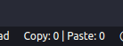

# Copy-Paste Tracker - VS Code Extension

## 🚀 Overview

Ever wondered how many times you hit **Ctrl + C** 🖱️ and **Ctrl + V** 📋 while coding? **Copy-Paste Tracker** is a fun VS Code extension that tracks the number of times you press these keys throughout your coding sessions. See if you're a **Ctrl + C** pro or a **Ctrl + V** champion! 🏆

## ⚡ Features

- **Track** the number of times you press **Ctrl + C** and **Ctrl + V**.
- **Real-time** counting that updates as you code.
- A fun and lighthearted way to check how often you copy and paste! 🧑‍💻✨

## 🎯 Installation

1. Open your **VS Code** editor.
2. Go to the **Extensions** view by clicking on the Extensions icon in the Activity Bar on the side of the window.
3. Search for "**Copy-Paste Tracker**."
4. Click **Install** on the extension.

Alternatively, you can install it directly from the **VS Code marketplace**: [Copy-Paste Tracker on Marketplace](https://marketplace.visualstudio.com/).

## 💡 Usage

- Once installed, simply start coding! The extension will start tracking your **Ctrl + C** and **Ctrl + V** presses.
- Check the **activity** in your status bar, where the count for both shortcuts is displayed.
- 

## 👀 Demo

Install it, press **Ctrl + C** and **Ctrl + V**, and see the magic happen! 🎉

Enjoy coding with a little fun added! 🎉 Happy coding! 💻✨
